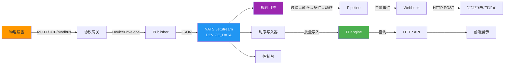
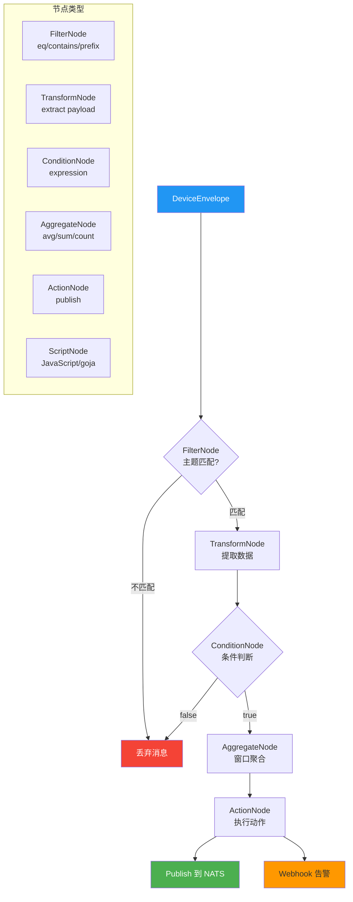
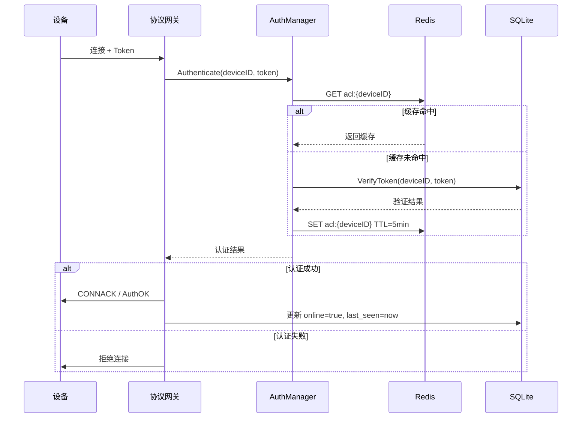
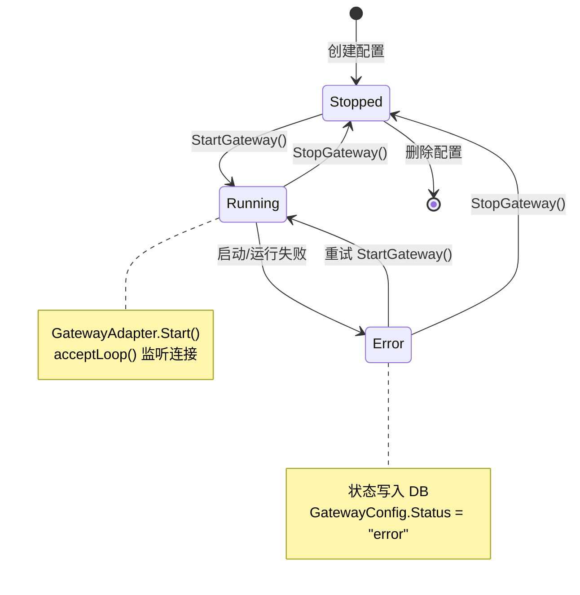
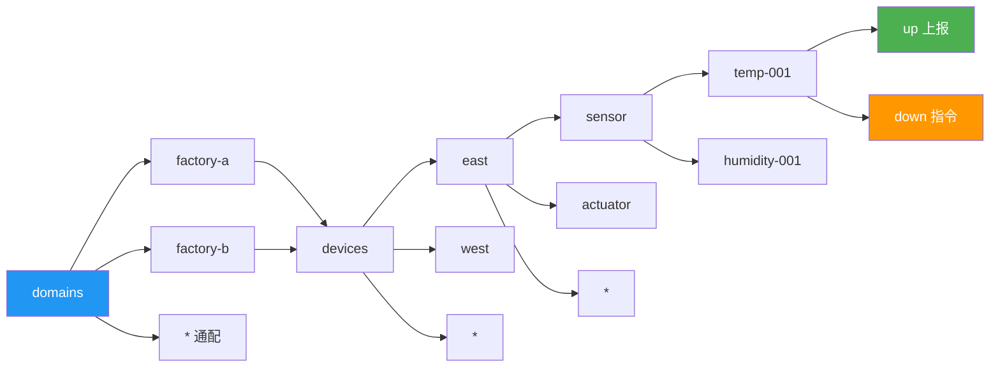

# IoT 数据中台 — 组件关系图

## 系统架构总览

```mermaid
graph TB
    subgraph Frontend["🖥️ Vue 3 前端 (:3000)"]
        Dashboard[Dashboard<br/>统计概览]
        Devices[Devices<br/>设备管理]
        Rules[Rules<br/>规则配置]
        Models[Models<br/>物模型]
        Alerts[Alerts<br/>告警管理]
        Domains[Domains<br/>域管理]
        Gateways[Gateways<br/>网关管理]
        DeviceData[DeviceData<br/>实时数据]
        FlowEditor[FlowEditor<br/>可视化规则编辑器]
    end

    subgraph API["🌐 Console API Server (:8080)"]
        DeviceHandler[DeviceHandler]
        DomainHandler[DomainHandler]
        ModelHandler[ModelHandler]
        RuleHandler[RuleHandler]
        AlertHandler[AlertHandler]
        GatewayHandler[GatewayHandler]
        StatsHandler[StatsHandler]
        DataHandler[DataHandler]
    end

    subgraph Services["⚙️ 业务服务层"]
        DeviceService[device.Service<br/>设备CRUD/认证]
        DomainService[domain.Service<br/>域/成员管理]
        ModelService[model.Service<br/>物模型/绑定]
        RuleConfigSvc[rule.RuleConfigService<br/>规则配置桥接]
        RuleEngine[rule.Engine<br/>规则链执行]
        AlertService[alert.AlertService<br/>Webhook管理]
        GatewayService[gateway.GatewayService<br/>网关配置CRUD]
        GatewayLauncher[gateway.Launcher<br/>网关生命周期]
        TSQuery[timeseries.QueryService<br/>时序查询]
    end

    subgraph Gateways["🔌 协议网关"]
        MQTTGW[mqtt.Gateway<br/>:1883<br/>MQTT 3.1.1]
        TCPGW[tcp.Gateway<br/>:9000<br/>自定义帧协议]
        ModbusGW[modbus.Gateway<br/>:502<br/>Modbus TCP]
        OPCUAGW[opcua.Gateway<br/>OPC-UA]
    end

    subgraph Core["📦 核心抽象"]
        GatewayAdapter[gateway.GatewayAdapter<br/>接口]
        Publisher[gateway.Publisher<br/>接口]
        Node[rule.Node<br/>接口]
        DeviceEnvelope[message.DeviceEnvelope<br/>统一消息格式]
    end

    subgraph Infrastructure["🏗️ 基础设施"]
        NATS[(NATS JetStream<br/>:4222)]
        TDengine[(TDengine<br/>:6030)]
        Redis[(Redis<br/>:6379)]
        SQLite[(SQLite<br/>文件DB)]
    end

    subgraph Consumers["📡 NATS 消费者"]
        StandaloneRuleEngine[rule-engine.exe<br/>独立规则引擎]
        TimeseriesWriter[timeseries-writer.exe<br/>时序写入器]
    end

    %% Frontend → API
    Devices --> DeviceHandler
    Domains --> DomainHandler
    Models --> ModelHandler
    Rules --> RuleHandler
    Alerts --> AlertHandler
    Gateways --> GatewayHandler
    Dashboard --> StatsHandler
    DeviceData --> DataHandler

    %% API → Services
    DeviceHandler --> DeviceService
    DomainHandler --> DomainService
    ModelHandler --> ModelService
    RuleHandler --> RuleConfigSvc
    AlertHandler --> AlertService
    GatewayHandler --> GatewayService
    GatewayHandler --> GatewayLauncher
    StatsHandler --> DeviceService
    StatsHandler --> AlertService
    StatsHandler --> GatewayService
    StatsHandler --> GatewayLauncher
    DataHandler --> TSQuery

    %% Services → Infrastructure
    DeviceService --> SQLite
    DomainService --> SQLite
    ModelService --> SQLite
    RuleConfigSvc --> SQLite
    RuleConfigSvc --> RuleEngine
    AlertService --> SQLite
    GatewayService --> SQLite
    TSQuery --> TDengine

    %% Gateway → Core
    MQTTGW -.->|implements| GatewayAdapter
    TCPGW -.->|implements| GatewayAdapter
    ModbusGW -.->|implements| GatewayAdapter
    OPCUAGW -.->|implements| GatewayAdapter

    MQTTGW --> Publisher
    TCPGW --> Publisher
    ModbusGW --> Publisher

    %% Publisher → NATS
    Publisher -->|PublishEnvelope| NATS

    %% Core types
    GatewayAdapter --> DeviceEnvelope
    Publisher --> DeviceEnvelope
    Node --> DeviceEnvelope

    %% NATS → Consumers
    NATS --> StandaloneRuleEngine
    NATS --> TimeseriesWriter
    StandaloneRuleEngine --> RuleEngine
    TimeseriesWriter --> TDengine

    %% Gateway Launcher
    GatewayLauncher --> MQTTGW
    GatewayLauncher --> TCPGW
    GatewayLauncher --> ModbusGW
    GatewayLauncher --> OPCUAGW

    %% Style
    classDef frontend fill:#e1f5fe,stroke:#0288d1
    classDef api fill:#f3e5f5,stroke:#7b1fa2
    classDef service fill:#e8f5e9,stroke:#388e3c
    classDef gateway fill:#fff3e0,stroke:#f57c00
    classDef infra fill:#fce4ec,stroke:#c62828
    classDef core fill:#f5f5f5,stroke:#616161

    class Dashboard,Devices,Rules,Models,Alerts,Domains,Gateways,DeviceData,FlowEditor frontend
    class DeviceHandler,DomainHandler,ModelHandler,RuleHandler,AlertHandler,GatewayHandler,StatsHandler,DataHandler api
    class DeviceService,DomainService,ModelService,RuleConfigSvc,RuleEngine,AlertService,GatewayService,GatewayLauncher,TSQuery service
    class MQTTGW,TCPGW,ModbusGW,OPCUAGW gateway
    class NATS,TDengine,Redis,SQLite infra
    class GatewayAdapter,Publisher,Node,DeviceEnvelope core
```

## 消息数据流

```mermaid
flowchart LR
    Device[物理设备] -->|MQTT/TCP/Modbus| GW[协议网关]
    GW -->|DeviceEnvelope| PUB[Publisher]
    PUB -->|JSON| NATS[NATS JetStream<br/>DEVICE_DATA]

    NATS --> RE[规则引擎]
    NATS --> TW[时序写入器]
    NATS --> CON[控制台]

    RE -->|过滤→转换→条件→动作| PIPE[Pipeline]
    PIPE -->|告警事件| WH[Webhook]
    WH -->|HTTP POST| EXT[钉钉/飞书/自定义]

    TW -->|批量写入| TD[TDengine]
    TD -->|查询| API[HTTP API]
    API --> FE[前端展示]

    style Device fill:#ff9800
    style NATS fill:#2196f3,color:#fff
    style TD fill:#4caf50,color:#fff
    style RE fill:#9c27b0,color:#fff
```

## 规则引擎 Pipeline 流程

```mermaid
flowchart TD
    MSG[DeviceEnvelope] --> F{FilterNode<br/>主题匹配?}
    F -->|不匹配| DROP[丢弃消息]
    F -->|匹配| T[TransformNode<br/>提取数据]
    T --> C{ConditionNode<br/>条件判断}
    C -->|false| DROP
    C -->|true| A[AggregateNode<br/>窗口聚合]
    A --> ACT[ActionNode<br/>执行动作]
    ACT --> NATS[Publish 到 NATS]
    ACT --> WH[Webhook 告警]

    subgraph NodeTypes["节点类型"]
        FN[FilterNode<br/>eq/contains/prefix]
        TN[TransformNode<br/>extract payload]
        CN[ConditionNode<br/>expression]
        AN[AggregateNode<br/>avg/sum/count]
        ACTN[ActionNode<br/>publish]
        SN[ScriptNode<br/>JavaScript/goja]
    end

    style MSG fill:#2196f3,color:#fff
    style DROP fill:#f44336,color:#fff
    style NATS fill:#4caf50,color:#fff
    style WH fill:#ff9800
```

## 设备认证流程

```mermaid
sequenceDiagram
    participant D as 设备
    participant GW as 协议网关
    participant Auth as AuthManager
    participant Redis as Redis
    participant DB as SQLite

    D->>GW: 连接 + Token
    GW->>Auth: Authenticate(deviceID, token)
    Auth->>Redis: GET acl:{deviceID}
    alt 缓存命中
        Redis-->>Auth: 返回缓存
    else 缓存未命中
        Auth->>DB: VerifyToken(deviceID, token)
        DB-->>Auth: 验证结果
        Auth->>Redis: SET acl:{deviceID} TTL=5min
    end
    Auth-->>GW: 认证结果
    alt 认证成功
        GW->>D: CONNACK / AuthOK
        GW->>DB: 更新 online=true, last_seen=now
    else 认证失败
        GW->>D: 拒绝连接
    end
```

## 网关生命周期

```mermaid
stateDiagram-v2
    [*] --> Stopped: 创建配置
    Stopped --> Running: StartGateway()
    Running --> Stopped: StopGateway()
    Running --> Error: 启动/运行失败
    Error --> Running: 重试 StartGateway()
    Error --> Stopped: StopGateway()
    Stopped --> [*]: 删除配置

    note right of Running: GatewayAdapter.Start()<br/>acceptLoop() 监听连接
    note right of Error: 状态写入 DB<br/>GatewayConfig.Status = "error"
```

## NATS 主题层次

```mermaid
graph LR
    ROOT[domains] --> D1[factory-a]
    ROOT --> D2[factory-b]
    ROOT --> DW[* 通配]

    D1 --> DE[devices]
    D2 --> DE

    DE --> R1[east]
    DE --> R2[west]
    DE --> RW[*]

    R1 --> T1[sensor]
    R1 --> T2[actuator]
    R1 --> TW[*]

    T1 --> ID[temp-001]
    T1 --> ID2[humidity-001]

    ID --> DIR1[up 上报]
    ID --> DIR2[down 指令]

    style ROOT fill:#2196f3,color:#fff
    style DIR1 fill:#4caf50,color:#fff
    style DIR2 fill:#ff9800,color:#fff
```
